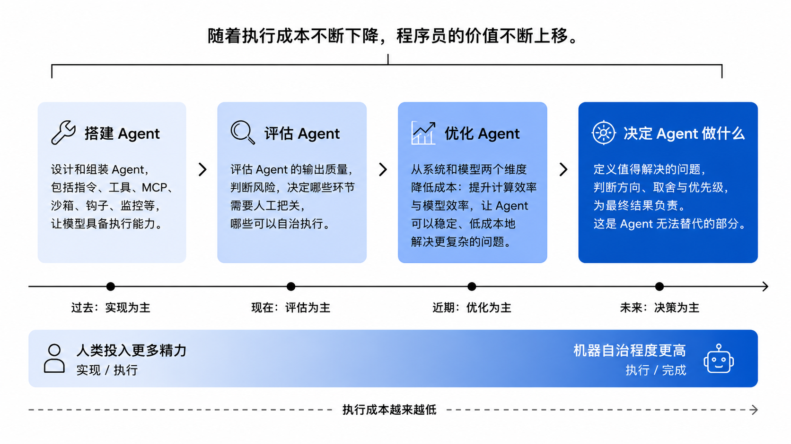

随着 LLM 不断发展、Harness 不断演进，Agent 的能力也在快速提升。这让我思考一个问题：当解决问题本身变得越来越便宜，我们这些靠解决问题谋生的人，价值还剩下什么？

我的答案是：程序员的价值并没有消失，而是在不断上移。

过去，我们更多关注如何实现；未来，我们会越来越多地关注如何组织 Agent、评估 Agent、优化 Agent，以及如何决定 Agent 应该去解决什么问题。

围绕这个变化，我认为程序员需要关注四件事。

## 搭建 Agent

Agent = LLM + Harness。模型是一个输入，其余的一切都属于 Harness：给它什么指令和规则、配哪些工具和 MCP、代码在什么沙箱里运行、什么时候派生子 Agent、在哪些节点插入确定性的钩子、跑偏了靠什么发现。用户真正感受到的 Agent 能力，往往不是模型决定的，而是 Harness 决定的。

基模本身并不难评估：跑几个 Benchmark，高下立判，真正困难的是如何把模型能力稳定地转化为用户体验。已有研究表明, 同一代基础模型，只是更换不同的 Harness，最终表现就可能相差一个数量级。同样是使用GPT-4 Turbo, 简单的 RAG ，在 SWE-bench 上只能解决不到 2% 的问题；而换上一套精心设计的 ACI（Agent-Computer Interface），可以达到 12.5%[^1]。Terminal Bench 2.0 上，LangChain 也展示了类似结果：模型完全没变，仅调整系统提示词和中间件，编码 Agent 的成绩便从 52.8 提高到 66.5[^2]。

如何快速上手 Harness 我以为的方法是通过阅读和修改优秀的开源框架，例如 Opencode、OpenClaw。因为成熟的开源框架几乎记录了整个社区如何设计、如何失败、又如何演进。学习它们，不只是学习实现方式，更是在学习世界上一群优秀的 Agent 开发者的思维模式。

## 评估 Agent
AI 改变的不只是写代码的速度，也改变了程序员每天真正花时间的地方。

过去，程序员的大部分时间花在实现需求；现在，程序员把越来越多的时间花在评估 Agent 的产出。

我更愿意把这种评估能力叫作品味（Taste）。它没有一个明确的定义，更像是一种长期积累出来的直觉。写过足够多的代码，也读过足够多优秀的实现之后，你通常能很快感觉到：这段代码靠谱吗？是不是只是"能跑"？还是已经到了可以长期维护的程度？ 这种能力很难速成，却会越来越重要。 既然评估开始成为新的瓶颈，真正需要优化的就不是判断本身，而是判断的成本。

我并不追求让 Agent 接管所有事情。真正应该减少的，不是判断，而是那些重复、机械的判断。人应该把时间留给那些真正需要负责的地方，剩下的，再交给 Agent。

Agent 应该拥有多少自治权，我通常只问三个问题：

做错了，多快能发现？
发现后，能不能干净回滚？
有没有客观证据证明它做对了？

如果三个问题都有明确答案，我通常就愿意让 Agent 端到端执行。只要有一个答不上来，人就应该留在关键节点。

不同任务，对 Agent 自动化程度的高低要求也不同。容易验证的工作，可以大胆放权；风险越高的工作，就越应该把评估和兜底做好。返工率、缺陷逃逸率、人工介入频率这些指标，往往比直觉更能说明一套流程是否真的值得继续自动化。

## 优化 Agent
随着 Agent 处理的问题越多，越复杂，成本开始成为新的约束，成本优化永远是推动技术发展的驱动力。

我理解的优化，大致有两条路线：一条优化计算效率，一条优化模型效率。

第一条路线，是提高计算效率。

很多人谈 Agent 成本，第一反应都是模型价格。但真正跑起来之后，你会发现，更大的问题其实是 GPU 有没有一直在干活。

处理单个请求时，GPU 大部分时间都在等待，MFU 通常只有 5%～15%。[^3] 一旦开始同时运行大量 Agent，这部分浪费就会迅速放大，并最终决定整个系统能够扩展到什么规模。

这也是为什么 Orchestration 如此重要。它真正解决的，并不是"让更多 Agent 并行"，而是让一组能力简单的 Agent 能够持续协作，减少等待、减少人工衔接，让 GPU 始终保持忙碌。

另一条路线，是提高模型效率。

强模型和中等模型之间，推理成本往往相差数倍。如果能把中等模型优化到足够接近强模型，就能以更低的成本完成大部分工作。而模型的强弱不在于模型的上限不同，而是对复杂问题输出稳定性的差异。

Agent 往往要连续执行几十个步骤，整个链路的可靠性会随着步骤增加不断下降。单步成功率 99%，连续执行 30 步之后整体仍只有约 74%；如果单步只有 95%，30 步之后就只剩约 21%。[^4]

所以，在垂直领域优化中等模型，我更关注的是缩小方差，而不是提高峰值。对于 Agent 来说，稳定通常比聪明更重要。

## 决定 Agent 去做什么
如果说前三件事讨论的还是如何更好地使用 Agent，那么最后一件事，关心的是 Agent 无法替你完成的部分。

AI 的确能把很多工作的效率提高一个数量级，但效率本身不会自动产生价值。 如果花几个小时把一件不值得做的事情做到极致，它依然是不值得做的。

随着执行成本不断下降，我们真正需要思考的问题反而越来越少和"怎么做"有关，而越来越多和"值不值得做"有关。

什么值得投入？

哪个方向值得继续？

什么时候应该停止？

这些问题没有标准答案，也没有任何 Benchmark 可以替你回答。 它们依赖对业务、用户和机会成本的理解，更重要的是，需要有人愿意为最终结果承担责任。

所以，当执行越来越便宜，选择反而变得越来越昂贵。 过去，技术约束限制了我们的想象力；今天，Agent 可以在几分钟内验证几十种方案，真正稀缺的已经不是实现能力，而是筛选和取舍的能力。

我一直很喜欢把 AI 比作一艘船，而人是掌舵的人。

船可以越来越快，也可以越来越智能，但它的目的，永远是让你能够到达目的地。

AI 可以规划一百条航线，也可以分析每条路线的风险，却不会替你决定目的地。不是因为它画不出路线，而是因为目的地本身没有唯一正确答案。最终做出选择的，只能是人；承担选择后果的，也只能是人。

## 总结

总而言之，我认为 Agent 会不断降低执行的成本，也会不断降低实现的门槛。 程序员的价值，并没有因此消失，而是在不断上移：从搭建 Agent，到评估 Agent，再到优化 Agent，最后回到 Agent 无法替你决定的地方。

**执行终将越来越便宜，选择却会越来越昂贵。真正决定程序员价值的，不再是解决问题，而是定义问题。**

## 引用

[1]: SWE-agent: Agent-Computer Interfaces Enable Automated Software Engineering (https://arxiv.org/pdf/2405.15793)  

[2]: Improving Deep Agents with harness engineering, LangChain Blog (https://www.langchain.com/blog/improving-deep-agents-with-harness-engineering)  

[3]: Efficiently Scaling Transformer Inference (https://arxiv.org/pdf/2211.05102)  

[4]: Measuring AI Ability to Complete Long Software Tasks (https://arxiv.org/pdf/2503.14499)